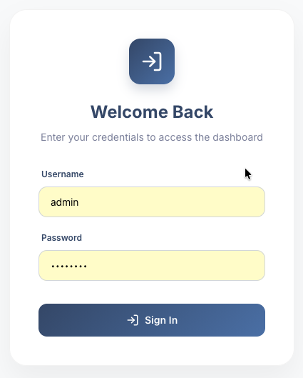
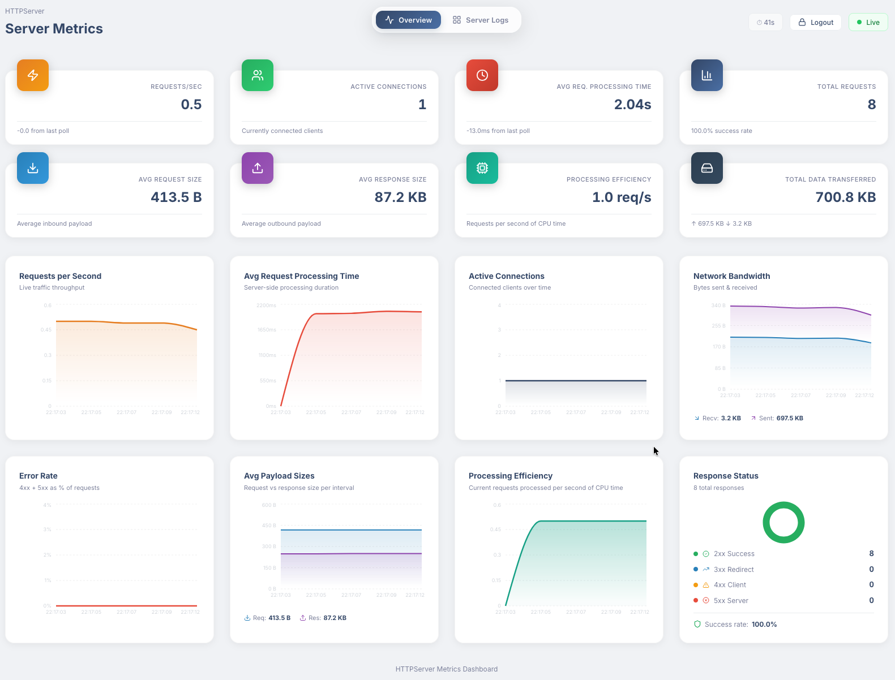
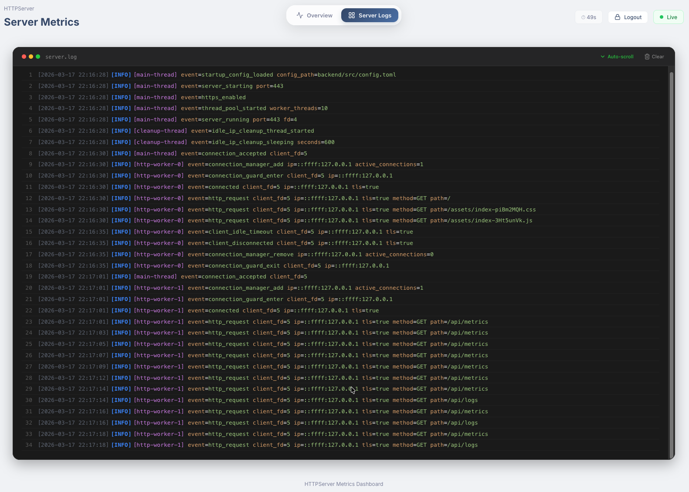

# HTTPServer Dashboard


A modern, high-performance HTTP server metrics dashboard built with C++ and React. This project provides real-time monitoring of web server performance powered by the [HTTPServer](https://github.com/HughStanway/HTTPServer) library.


## Features

- **Real-time Metrics**: Monitor active connections, total requests, and response status codes (2xx, 3xx, 4xx, 5xx).
- **Secure Access**: Integrated Basic Authentication to protect sensitive metrics data.
- **Modern Dashboard**: A sleek, responsive frontend built with React and Recharts.
- **HTTPS Support**: Built-in support for secure communication.
- **SPA Ready**: Configured as a Single Page Application with backend routing support.

## Tech Stack

### Backend
- **C++20**: Utilizing modern C++ features for performance and safety.
- **HTTPServer Library**: A custom high-performance HTTP server library.
- **CMake**: Robust build system configuration.

### Frontend
- **React 19**: Modern component-based architecture.
- **Vite 8**: Fast production builds and development experience.
- **Vanilla CSS**: Premium UI with custom styling (clean, modern, and efficient).
- **Recharts**: Beautiful, interactive data visualizations.
- **Framer Motion**: Smooth animations and transitions.

## Prerequisites

- **macOS** (for the current configuration)
- **CMake** (v3.15 or higher)
- **C++ Compiler** (supporting C++20)
- **Node.js & npm** (for frontend development)
- **HttpServer Library**: Fast and modular HTTP server framework.

## Getting Started

### 1. Clone the repository
```bash
git clone https://github.com/HughStanway/HTTPServer-dashboard.git
cd HTTPServer-dashboard
```

### 2. Configure Environment
Create a `.env/credentials` file with your preferred Basic Auth credentials:
```text
admin:password
```
*(Note: Ensure your SSL certificates are present in `.env/cert.pem` and `.env/key.pem` if HTTPS is enabled.)*

### 3. Build and Run
Use the provided `Makefile` to build both frontend and backend and start the server:
```bash
make run
```
This command will:
1.  Install frontend dependencies and build the React app.
2.  Configure and compile the C++ backend.
3.  Launch the `dashboard_server`.

## Project Structure

- `backend/`: Backend source code and configuration.
  - `src/main.cpp`: Entry point and route definitions.
  - `src/auth/auth.cpp/h`: Authentication logic.
  - `src/config.toml`: Server configuration.
  - `CMakeLists.txt`: Backend build configuration.
- `frontend/`: Frontend source code (React/TypeScript).
  - `src/`: React components and logic.
  - `dist/`: Compiled production assets.
- `Makefile`: Convenient build script for the entire project.

## License

This project is licensed under the MIT License - see the [LICENSE](LICENSE) file for details.

---

## Project Screenshots

<div align="center">
  <h3>Login Screen</h3>
  
  <p><em>A secure and elegant entry point that leverages Basic Authentication to protect your server's metrics data, featuring a modern design that integrates seamlessly with the overall dashboard aesthetic.</em></p>
  
  <br/>
  
  <h3>Metrics Overview</h3>
  
  <p><em>A comprehensive real-time visualization suite that transforms raw server metrics into actionable insights through beautifully rendered interactive charts, monitoring everything from traffic throughput and request latency to active connection states and network bandwidth consumption.</em></p>
  
  <br/>
  
  <h3>Server Logs</h3>
  
  <p><em>A powerful, real-time log exploration interface that intelligently parses and syntax-highlights server-side events, providing developers with a clear and structured view of incoming requests, internal threading activities, and potential system warnings or errors.</em></p>
</div>
